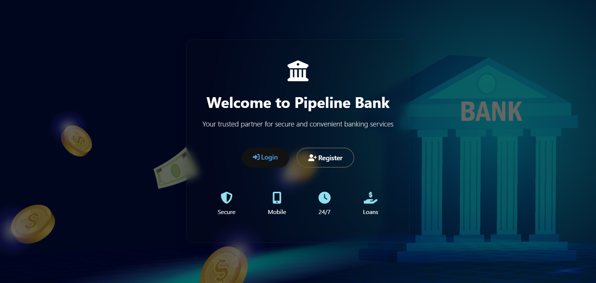
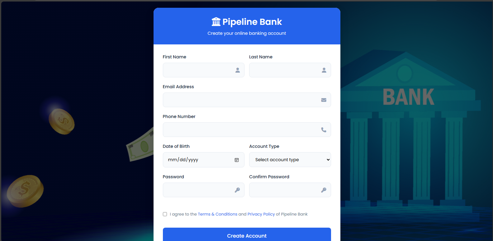
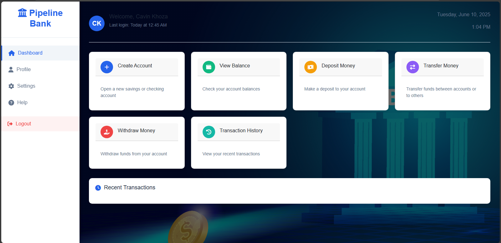

# 🏦 Pipeline Bank - Modern Online Banking System






A modern, responsive online banking system with a sleek user interface for account management, transactions, and user authentication.

## 🌟 Features

- **User Authentication**: Secure login and registration system
- **Dashboard**: Comprehensive overview of accounts and transactions
- **Account Management**: Create, view, and manage bank accounts
- **Transactions**: Deposit, withdraw, and transfer funds
- **Virtual Bank Card**: Interactive card with flip animation
- **Responsive Design**: Works on all device sizes
- **Modern UI**: Clean, intuitive interface with animations
- 

## 🚀 Getting Started

To get a local copy up and running, follow these simple steps.

### Prerequisites

You only need a modern web browser to view these files.

### Installation

1.  **Clone the repository:**
    ```bash
    git clone [https://github.com/calvinkhoza/Banking-system.git](https://github.com/calvinkhoza/Banking-system.git)
    ```
    
2.  **Navigate to the project directory:**
    ```bash
    cd Banking-system
    ```

3.  **Open the `interface.html` file in your web browser.** This is the main landing page.

## 📂 Project Structure
```
└───Banking-system-master
    │----bank.jpg
    │----dashboard.html
    │----form.html
    │----interface.html
    │----README.md
    │
    └───bank
            bank.jpg
            dashboard.html
            form.html
            interface.html
```
## 🛠️ Technologies Used

- **Frontend**: HTML5, CSS3, JavaScript
- **Styling**: Custom CSS with CSS Variables
- **Icons**: Font Awesome 6
- **Responsive Design**: Media Queries
- **Animations**: CSS Keyframes
  
## 📜 License
Distributed under the MIT License. See LICENSE for more information.
